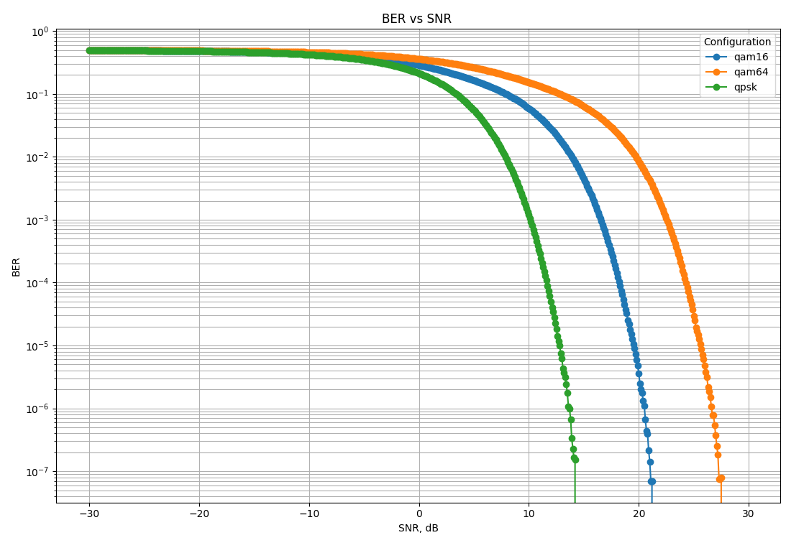

# QAM Simulator

## Main Implementation Location  
The **primary code** resides in the `old` branch.  
This branch contains a **simplified version** of the codebase.  

#### Removed for Simplicity:  
- All C++ templates
- Optimizations 
- Soft-decision demodulator  
- Unit tests 

## Prerequisites

### 1. Install Required Tools
Install the following packages on a Linux system (Ubuntu/Debian):

```bash
sudo apt-get update
sudo apt-get install g++ cmake python3 python3-pip
```

### 2. Install Python Dependencies
Install required Python libraries for plotting:

```bash
pip3 install pandas matplotlib
```

---

## Build Instructions

### 1. Build
```bash
cmake -B build -S .
cmake --build build
```

### 2. Run the Application
```bash
./build/qam_simulator -20 20 1 4 100000 25
```

### 3. Generate BER vs SNR Plot
```bash
cmake --build build --target plot
```
This runs the Python script `plot_ber.py` to generate a plot of BER vs SNR.

---

## Results
After running simulations, CSV files are generated. The Python script `plot_ber.py` reads these files and creates a combined plot.

### Example Output:
 
